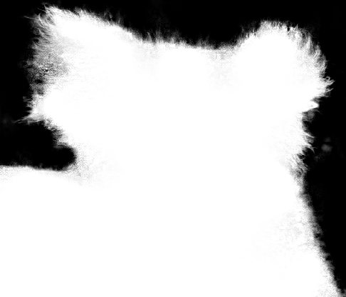

# A closed-form solution to natrual image matting(Optimized by cuda and mkl)

Implementation of A. Levin D. Lischinski and Y. Weiss. A Closed Form Solution to Natural Image Matting. IEEE Conf. on Computer Vision and Pattern Recognition (CVPR), June 2006, New York with the help of nvidia cuda and intel mkl.

The code is tested on my laptop with the following configurations:

cpu: intel i7-7700HQ

gpu: GTX1060

windows configuration:

windows 10

visual studio: vs2015

cuda 8.0

linux configuration:

ubuntu 16.04

g++ 5.4.0

cuda 8.0

<br>

####For Linux User

First, compile the code with the following command line.

```bash
cd linux
mkdir build
cd build
cmake ..
make
```

Second, execute the code with the following command line.

```bash
./CfMatting /path/to/original_image /path/to/labeled_image /path/to/results
```

<br>

####For Windows User

First, set the compile mode to Release and x64 (default is debug and x86).

Second, set up include path and library path for opencv & mkl, specify opencv & mkl static library in linker.

Third, compile the code

Fourth, execute the code in following command line.

```
CfMatting /path/to/original_image /path/to/labeled_image /path/to/results
```

<br>

####Example Results

 +  = 

image resolution: 416*486

linux execution time: ~1.16s

windows execution time: ~1.90s

(Note: I didn't use the down-sample trick to speed up the calculation)

